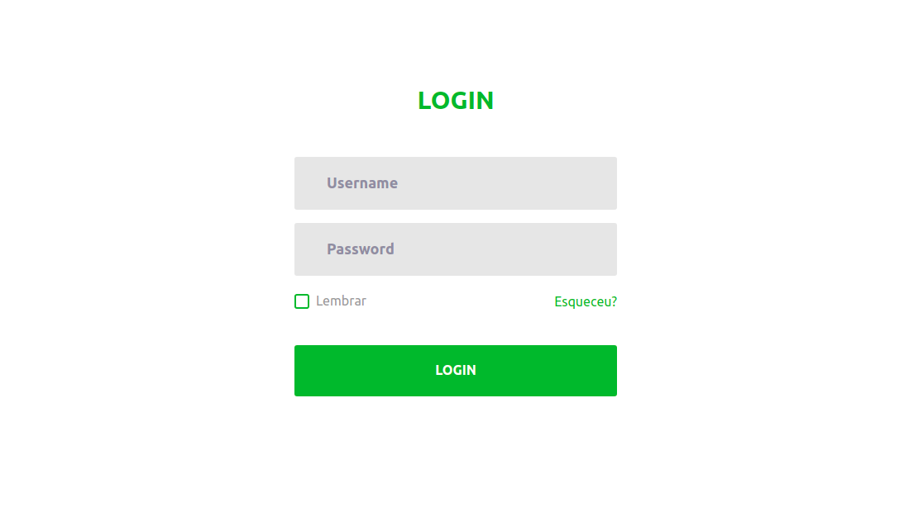
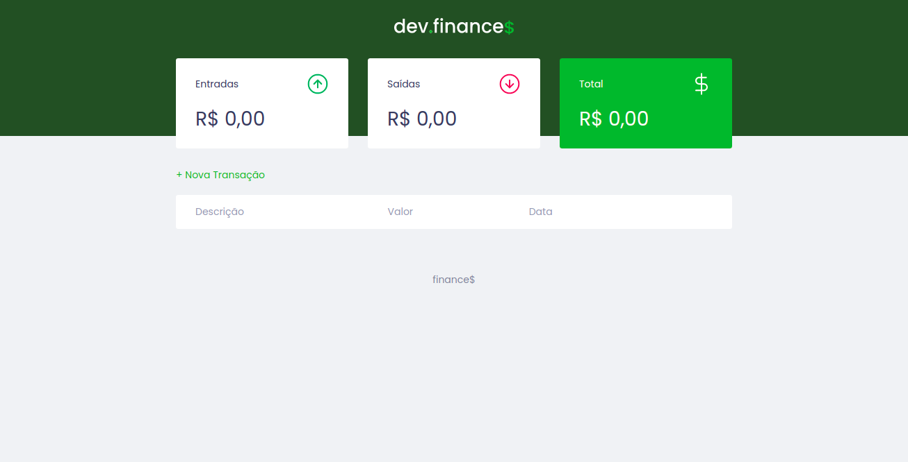

# Finances
## :clipboard: **Descrição**
  
  Sistema de finanças desenvolvido para organizar os custos mensais do usuário. O objeto é garantir o controle no gastos do indivíduo.

- **Finances**
  1. Tela Login
    

        
      
  
  
    2. Tela Principal
    

        
      

- **Linguagens Usadas**
  
  1. Javascript
  2. CSS
  3. PHP
  4. SQL